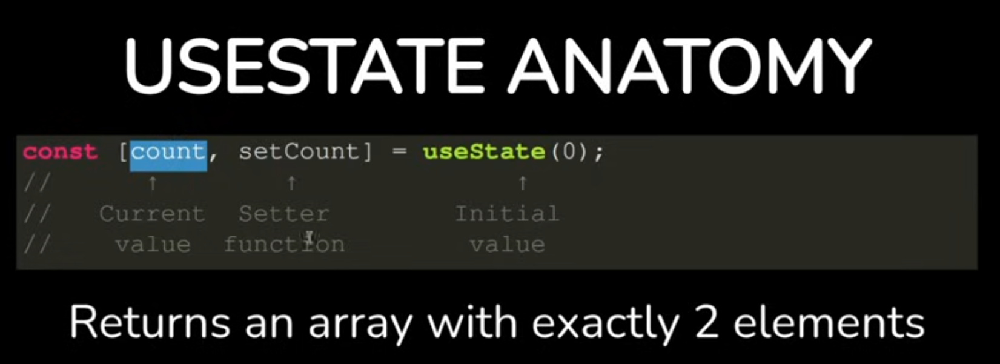
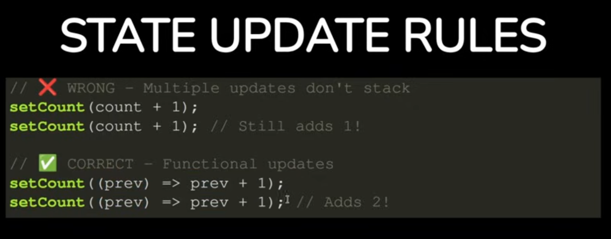
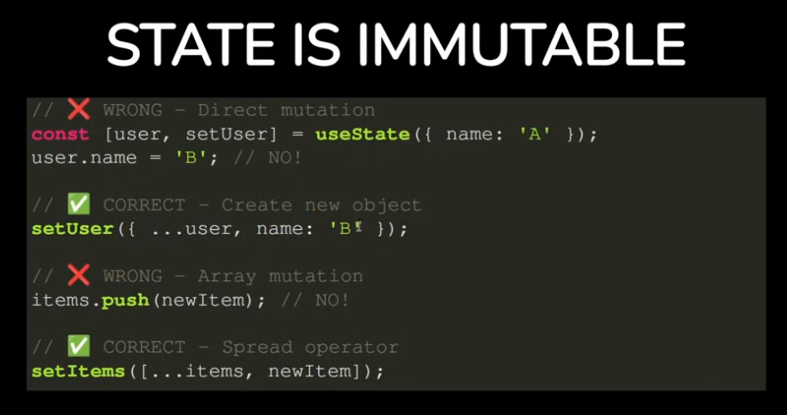

# React

## 1. what is React

Library, not framework (unlike Angular is a Framework). Developed by facebook.
It's SPA (Single page application). Made from reusable components. </br>

Benefit:

- component: has logic and UI
- statement
- vitual DOM (document object modle, HTML), more fast, only update the change part instead of whole page
- easy to mantain
- flexible

## 2. set up

npm create vite@latest --react --javaScript
npm run dev

## 3. JSX

### JSX dynamic expression

- variable
- function
- ternaryOperator
- list

## 4. Components

### 4.1 props

Parent component can pass props to children component.
Simple and eazy to understand.

### lifeCycle

- mounting: add to dom
- updating: change of state/props, update UI ⭐
- unmounting: remove from dom

## 5. Hooks

Introduced from React 16.8.
允许在函数组件中使用状态和生命周期，替代了类组件中（state，lifecycle）中复杂的状态管理和生命周期

### 5.1 useState

状态钩子，适用于组件需要修改状态
比如：输入框内容，计数器

### 5.2 useEffect

副作用钩子，control lifeCycle of component </br>
useEffect接受两个参数：回调参数 (logic of side effect)，依赖数组（dependencies, 决定when to execute useEffect）</br>
use senario:

- send reuqest get data from database ⭐
- add event listener
- setTimeout or setInterval
- clear event listener, clear timeout

#### 5.2.1 依赖数组 (dependency)

- 无依赖: 每次组件渲染后都会执行
- 空数组[ ] (empty array): only executed when mounted (only once); used in send request to backend server
- 有依赖项: event listener
- 清理副作用

### 5.3 useContext

access share data in react context. avoid prop drilling,

- theme
- user information
- language

## 6. 条件渲染 conditional rendering

### 6.1 how to do conditional rendering

- if syntax
- 三元运算符 ternary operator
- 逻辑和运算符 logical and or
- switch

### 6.2 map rendering

- iterator elements for list
- key used for identify each element inside the list, should be unique. 优化渲染性能，可以直接更新和移除对应元素
- don't forget "return" keyword

## 6.3 受控组件 form input

## 7. 回调函数

父组件传函数给子组件，子组件通过调用函数把数据回传给父组件</br>

- react中，子组件不能直接改变父组件
- 子组件通过调用父组件传递的回调函数，将数据传递给父组件
- 父组件通过props传递给子组件，子组件在合适的时间调用它

## 8. custome hook

重复利用代码，custome hook

- must start with `use` like `useForm.ts`
- it's javaScript function, not react

## 9. TailwindCss

### 9.1 Install
```bash
npm install tailwindcss @tailwindcss/vite 
```
Then, add Tailwind Css to `vite.config.ts`</br>
Last add `@import "tailwindcss";` to `index.css`</br>
Also add extension for auto complelete: `Tailwind CSS IntelliSense`

### 9.2 how to apply
Keyword: `className`

### 9.3 common usage
边框：border border-blue-500 focus:ring focus:ring-blue-200 outline-none

## 10. Router
### 10.1 局部渲染
不同于传统方式，刷新整个页面，react是SPA(Single page application)，局部渲染。
只更新部分components，不会刷新整个页面
- 不会刷新全页面
- 只渲染相关组件
- 保持应用状态：全局状态下，已加载的资源会保持不变

### 10.2 Install
```bash
npm install react-router-dom
````
- add `<BrowserRouter>` to `main.tsx`
- define `<Routes>`, `<Route>` in `App.tsx`

### 10.3 code example
- 用`<Link to="/about">`tag instead of `<a href="/about">`
- `import {Routes, Route} from 'react-router-dom'`
- 可以在路径中定义参数，并在组件中访问这些参数
``` bash
<Route path="/user/:id" component={User} />

const User = () => {
  const {id} = useParams(); // deconstructor id
}
```
- redirect 重定向于导航
``` bash
<Redirect to="/new-path">
```

## 11. Connect with API
### 11.1 Fetch
```bash
const response = await fetch(url);
```
### 11.2 axios
```bash
npm install axios
```


## questions

- devDependencies vs denpendencies
- onclick={changeNameOnClick} instead of {changeNameOnClick()}
- 怎么确保代码的可维护性？ create custome hook
- how to apply tailwind




